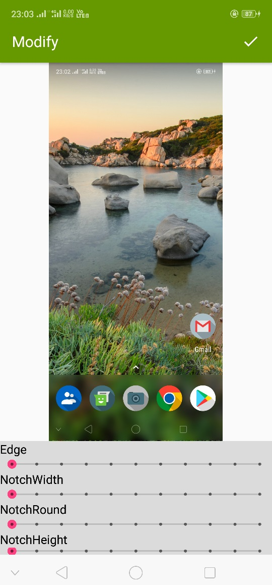
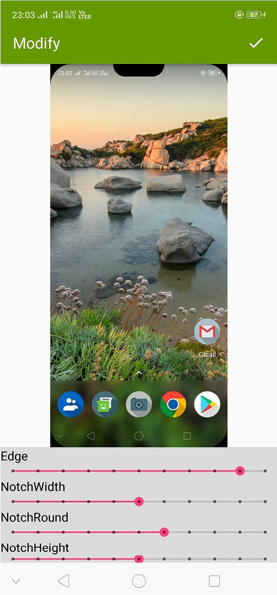

CameraBlur:Portrait mode using DeeplabV3+ Semantic Image Segmentation 
=====================================================================
An android app to apply notch filter to screenshots and give them a custom cutout with notch and rounded edges.

## Downloads

Download apk from [here](https://github.com/Gauravv97/NotchShot/raw/master/apk/NotchShot.apk)

## Some Samples

        
 

## Features

* Customize notch width, height.
* Give Rounded edges

## Todo

* [ ] Give option to save your filters.
* [ ] Gallery.

## About

Copyright 2018 Gaurav Chaudhari, and licensed under the Apache License, Version 2.0. No attribution is necessary but it's very much appreciated. Star this project if you like it!

